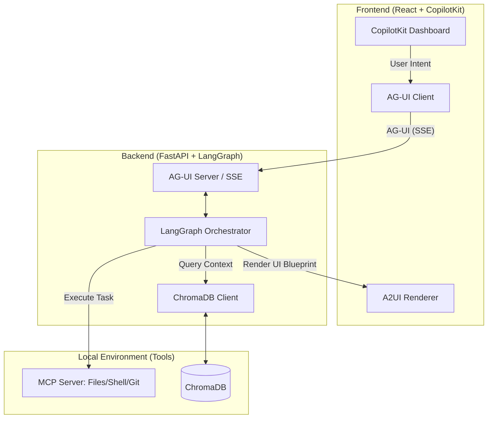

# Architecture Overview: Agentic DevStudio

## 1. System Components
The architecture is divided into three distinct layers: the **UI Layer** (User Experience), the **Orchestration Layer** (The Logic), and the **Capability Layer** (Tools & Memory).

| Layer | Component | Responsibility |
| :--- | :--- | :--- |
| **UI** | **CopilotKit (React)** | Host application and user-facing dashboard. |
| **Orchestration** | **LangGraph** | Multi-agent state management and task routing. |
| **Transport** | **AG-UI Protocol** | Real-time event streaming (SSE) between Brain and UI. |
| **UI Protocol** | **A2UI (DeepMind)** | Declarative JSON blueprints for dynamic UI rendering. |
| **Capability** | **MCP Servers** | Local filesystem access, shell execution, and Git controls. |
| **Memory** | **ChromaDB** | Semantic vector storage for cross-agent/cross-dev context. |

---

## 2. Communication Flow & Protocols

### A. The "Nerve" System: AG-UI (Agent-to-UI)
The communication between your **LangGraph Backend** and **CopilotKit Frontend** happens via **AG-UI** over Server-Sent Events (SSE).
*   **Status Streaming:** As LangGraph moves from `Architect` → `Builder`, AG-UI emits `TOOL_CALL_START` and `TEXT_CONTENT` events to keep the UI updated.
*   **State Sync:** The internal state of the agents (e.g., "Current Task: Login Form") is mirrored to the frontend automatically.

### B. The "Visual" Language: A2UI
When an agent needs to show something complex (like a Kanban board or a code diff), it doesn't send HTML. It sends an **A2UI JSON payload**:
*   **Flow:** Agent → `surfaceUpdate` (JSON) → AG-UI Stream → **A2UI Renderer** (Frontend).
*   **Benefit:** The frontend renders these using *native* React components, maintaining security and consistent styling.

### C. The "Hands": Model Context Protocol (MCP)
Agents interact with the developer's local environment through **MCP**.
*   **Execution:** The `Builder Agent` sends a JSON-RPC request to the local MCP Server (e.g., `write_file(path, content)`).
*   **Isolation:** The agent never touches the OS directly; it only speaks to the MCP server, which acts as a secure proxy.

---

## 3. Data Integration Diagram

## 4. Key Integration Points
Semantic Synchronization:

*   Whenever the QA Agent approves a task, the Architect Agent triggers an Embedding Job.
*   The code summary is sent to ChromaDB, making it immediately "visible" to other developers' agent pods.

The Git Traffic Light:

*   The Builder Agent uses MCP to run git checkout -b.
*   Before merging, the Architect Agent queries the GitHub API (via MCP) to check for open PRs on the same files, preventing conflicts before they happen.

Cross-Pod Context:

*   If Dev A builds AuthService.ts, Dev B's agent will find it in ChromaDB when asked to build the LoginView, ensuring it imports the correct existing service.