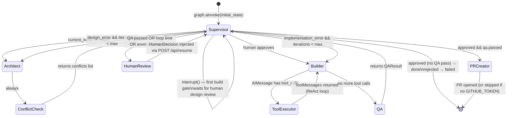

# pod-brain

The orchestration core of Agentic DevStudio. A pure Python library that drives a team of AI agents — **Architect → Builder → QA** — to autonomously build features in external target repositories.

`pod-brain` has no server of its own. The FastAPI app in `apps/studio-api/` imports it, exposes its graph over HTTP, and streams agent progress back to the UI.

---

## Agent Graph Architecture



---

## Nodes

### Agent nodes
The three nodes that make LLM calls and do the core reasoning work.

| Node | LLM calls | What it does |
|---|---|---|
| **Architect** | 1× `with_structured_output(DesignPlan)` | Queries ChromaDB for codebase context, produces a `DesignPlan` (files to create/modify, branch name, constraints). |
| **Builder** | 1× `bind_tools(mcp_tools)` per iteration | Receives `DesignPlan`, calls MCP tools to write code into the target repo. ReAct loop handled by graph edges (`Builder ↔ ToolExecutor`). |
| **QA** | 2× LLM calls | Phase 1: ReAct tool loop runs lints/tests via `execute_command`. Phase 2: structured evaluator produces `QAResult`. |

### Pipeline nodes
Non-LLM nodes that handle routing, gating, and side-effects. The main flow passes through them but doesn't revolve around them.

| Node | What it does |
|---|---|
| **Supervisor** | Pure Python routing function. Reads `current_node` + `qa_result`, sets `next_node`. Fires `interrupt()` at the two human gates. |
| **ConflictCheck** | Pre-flight: runs `git diff --name-only main...{branch}` for every active branch, compares against the plan's files. Non-fatal — failures return empty conflicts. |
| **ToolExecutor** | LangGraph `ToolNode`. Executes MCP tool calls emitted by Builder/QA and returns `ToolMessage` results. |
| **HumanReview** | Passthrough. Reached only after an interrupt is resumed. Human injects `HumanDecision` via `/api/resume`. |
| **PRCreator** | Calls the `open_pr` MCP tool to push the branch and open a GitHub PR. Non-fatal — logs and continues if `GITHUB_TOKEN` is missing. |

---

## Human-in-the-Loop

Two `interrupt()` points, both fired from inside `supervisor_node`:

| Gate | When | Resume call |
|---|---|---|
| **Conflict override** | ConflictCheck found file overlap with another active branch | `POST /api/resume { thread_id, approved: true/false }` |
| **Design review** | First Builder run — human approves the plan before any code is written | `POST /api/resume { thread_id, approved: true, instructions? }` |
| **PR gate** | After QA passes — before any PR is opened | `POST /api/resume { thread_id, approved: true/false, override_target? }` |

QA → Builder loop-backs do **not** re-trigger an interrupt. Only the first build requires human sign-off.

`override_target` on rejection routes the supervisor to `"builder"`, `"architect"`, or `"done"`.

---

## Loop Protection

```
builder_iterations >= max_builder_loops    →  human_review (escalate)
architect_iterations >= max_architect_loops →  human_review (escalate)
failure_category == "environment_error"    →  human_review (always escalate)
```

Configure via: `POD_BRAIN_MAX_BUILDER_LOOPS`, `POD_BRAIN_MAX_ARCHITECT_LOOPS`.

---

## Checkpointing

Every graph super-step is checkpointed by `thread_id`. If the server restarts mid-run the graph resumes from the last checkpoint.

| Environment | Checkpointer | Config |
|---|---|---|
| Local dev / tests | `MemorySaver` or `SqliteSaver` | `POD_BRAIN_CHECKPOINTER_DB=./brain.db` |
| Production | `AsyncPostgresSaver` | `POD_BRAIN_CHECKPOINTER_DB=postgres://user:pw@host/db` |

---

## MCP Tool Contract

pod-brain connects to pod-mcp over SSE (`POD_BRAIN_POD_MCP_URL`, default `http://localhost:8001`).

| Tool | Used by | Purpose |
|---|---|---|
| `read_file` | Architect, Builder, QA | Read a file from the target repo |
| `write_file` | Builder | Write/overwrite a file |
| `edit_file` | Builder | Surgical string replacement in a file |
| `delete_file` | Builder | Delete a file |
| `list_directory` | All | List directory contents |
| `get_file_tree` | Architect | Recursive directory tree |
| `search_files` | Architect | Glob search across target repo |
| `find_in_files` | Architect, QA | Regex search across file contents |
| `execute_command` | Builder, QA | Run shell commands (lint, test, etc.) |
| `create_branch` | Builder | Create a git feature branch |
| `git_add` | Builder | Stage files |
| `git_commit` | Builder | Commit staged changes |
| `git_diff` | QA | Show staged or unstaged diff |
| `open_pr` | PRCreator | Push branch and open a GitHub PR |

All tools require a `repo_path` argument — the absolute path to the target repo passed from the frontend at request time.

---

## Configuration

| Env var | Default | Description |
|---|---|---|
| `POD_BRAIN_GEMINI_API_KEY` | _(required)_ | Google Gemini API key |
| `POD_BRAIN_GEMINI_MODEL` | `gemini-2.5-pro` | Model for all three agents |
| `POD_BRAIN_POD_MCP_URL` | `http://localhost:8001` | pod-mcp server base URL |
| `POD_BRAIN_CHROMA_URL` | `http://localhost:8000` | ChromaDB server URL |
| `POD_BRAIN_CHECKPOINTER_DB` | `:memory:` | SQLite path or `postgres://...` |
| `POD_BRAIN_MAX_BUILDER_LOOPS` | `3` | Max Builder retries before escalating |
| `POD_BRAIN_MAX_ARCHITECT_LOOPS` | `2` | Max Architect replans before escalating |

---

## Running Tests

```bash
uv run pytest packages/pod-brain/tests/ -v
uv run pytest packages/pod-brain/tests/test_supervisor.py -v   # routing logic
uv run pytest packages/pod-brain/tests/test_graph.py -v        # graph wiring
```
