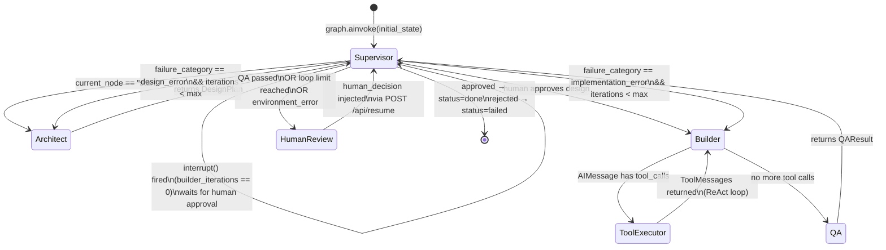

# pod-brain

The orchestration core of Agentic DevStudio. A pure Python library that drives a team of AI agents — **Architect → Builder → QA** — to autonomously build features in external target repositories.

`pod-brain` has no server of its own. The FastAPI app in `apps/studio-api/` imports it, exposes its graph over HTTP, and streams agent progress back to the UI.

---

## How a Request Flows Through the System

```
User
 │
 │  POST /api/run  { task, target_repo, thread_id }
 ▼
┌─────────────────────────────────────────────────────┐
│  apps/studio-api  (FastAPI)                         │
│                                                     │
│  • Validates request                                │
│  • Builds initial PodState                          │
│  • Calls graph.astream_events()                     │
│  • Translates LangGraph events → AG-UI SSE events   │
│  • Streams back to caller as text/event-stream      │
└──────────────────────┬──────────────────────────────┘
                       │  imports & calls
                       ▼
┌─────────────────────────────────────────────────────┐
│  pod-brain  (this package)                          │
│                                                     │
│  Compiled LangGraph StateGraph                      │
│  ┌─────────────┐                                    │
│  │  Supervisor │ ← pure Python routing function     │
│  │  (no LLM)   │   reads state, decides next node  │
│  └──────┬──────┘                                    │
│         │                                           │
│    ┌────▼─────┐    ┌─────────────┐    ┌──────────┐ │
│    │Architect │───▶│   Builder   │───▶│    QA    │ │
│    │  (LLM)   │    │   (LLM +   │    │  (LLM +  │ │
│    │          │    │  MCP tools) │    │ MCP tools│ │
│    └──────────┘    └─────────────┘    └──────────┘ │
│                                                     │
│  AsyncSqliteSaver checkpointer (per thread_id)      │
└───────────────────┬─────────────────────────────────┘
          calls via │ SSE (http://localhost:8001/mcp)
                    ▼
┌─────────────────────────────────────────────────────┐
│  pod-mcp  (MCP server — Phase 2)                    │
│                                                     │
│  read_file  write_file  list_directory              │
│  search_files  execute_command  create_branch       │
│                                                     │
│  All operations target the EXTERNAL repo only       │
└──────────────────────┬──────────────────────────────┘
                       │ reads/writes
                       ▼
              [ Target repo on disk ]
              e.g. /home/dev/my-app
```

---

## Agent Graph Architecture



### Node responsibilities

| Node | Model calls | What it does |
|---|---|---|
| **Supervisor** | None | Pure routing function. Reads `current_node` + `qa_result`, returns `next_node`. Fires `interrupt()` on first builder entry. |
| **Architect** | 1× `with_structured_output(DesignPlan)` | Queries ChromaDB for context, produces a `DesignPlan` (files to create/modify, branch name, constraints). |
| **Builder** | 1× `bind_tools(mcp_tools)` per iteration | Receives `DesignPlan`, calls MCP tools to write code into the target repo. Tool loop handled by graph edges (`Builder ↔ ToolExecutor`). |
| **QA** | 2× LLM calls | Phase 1: ReAct tool loop runs lints/tests via `execute_command`. Phase 2: structured evaluator produces `QAResult`. |
| **ToolExecutor** | None | LangGraph `ToolNode`. Executes MCP tool calls emitted by Builder and returns `ToolMessage` results. |
| **HumanReview** | None | Passthrough node. Reached only after interrupt is resolved. Human injects `HumanDecision` via `/api/resume`. |

---

## Human-in-the-Loop

Two interrupt points exist in the graph:

| Interrupt | When | How to resume |
|---|---|---|
| **Design review** | Before the first Builder run (supervisor fires `interrupt()` when `builder_iterations == 0`) | `POST /api/resume { thread_id, approved: true }` |
| **PR gate** | After QA passes — before any PR is opened | `POST /api/resume { thread_id, approved: true/false, override_target? }` |

QA → Builder loop-backs do **not** re-trigger the interrupt. Only the first build requires human sign-off.

If the human sends `approved: false` with an `override_target`, the supervisor routes accordingly:
- `"builder"` → re-run the Builder (e.g. human has a specific fix in mind)
- `"architect"` → re-plan from scratch
- `"done"` → terminate with `status: "failed"`

---

## Loop Protection

If agents get stuck, the supervisor escalates rather than looping forever:

```
builder_iterations >= max_builder_loops  →  human_review (escalate)
architect_iterations >= max_architect_loops  →  human_review (escalate)
failure_category == "environment_error"  →  human_review (always escalate)
```

Configure limits via env vars: `POD_BRAIN_MAX_BUILDER_LOOPS`, `POD_BRAIN_MAX_ARCHITECT_LOOPS`.

---

## Checkpointing

Every graph super-step is checkpointed. This means:
- If the server restarts mid-run, the graph resumes from the last checkpoint.
- The human can review state at any time: `graph.get_state(config)`.
- Each feature request is isolated by `thread_id`.

| Environment | Checkpointer | Config |
|---|---|---|
| Local dev / tests | `AsyncSqliteSaver` (`:memory:` or file) | `POD_BRAIN_CHECKPOINTER_DB=./brain.db` |
| Production / multi-user | `AsyncPostgresSaver` | `POD_BRAIN_CHECKPOINTER_DB=postgres://user:pw@host/db` |

The swap is automatic: `build_graph()` inspects whether the DB string starts with `postgres://`.

---

## MCP Tool Contract

pod-brain connects to pod-mcp over SSE (`POD_BRAIN_POD_MCP_URL`, default `http://localhost:8001`).
The tool names it expects **must match exactly** what pod-mcp exposes:

| Tool name | Used by | Purpose |
|---|---|---|
| `read_file` | Architect, Builder, QA | Read a file from the target repo |
| `write_file` | Builder | Write/overwrite a file in the target repo |
| `list_directory` | Architect, Builder, QA | List directory contents |
| `search_files` | Architect | Grep-style search across target repo |
| `execute_command` | Builder, QA | Run shell commands (lint, test, etc.) in target repo |
| `create_branch` | Builder | Create a git feature branch in target repo |

---

## Configuration Reference

All settings are read from env vars prefixed `POD_BRAIN_` or from a `.env` file at the repo root.

| Env var | Default | Description |
|---|---|---|
| `POD_BRAIN_ANTHROPIC_API_KEY` | _(required)_ | Anthropic API key |
| `POD_BRAIN_ANTHROPIC_MODEL` | `claude-sonnet-4-5` | Model for all three agents |
| `POD_BRAIN_POD_MCP_URL` | `http://localhost:8001` | pod-mcp server base URL |
| `POD_BRAIN_CHROMA_URL` | `http://localhost:8000` | ChromaDB server URL |
| `POD_BRAIN_CHECKPOINTER_DB` | `:memory:` | SQLite path or `postgres://...` |
| `POD_BRAIN_MAX_BUILDER_LOOPS` | `3` | Max Builder retries before escalating |
| `POD_BRAIN_MAX_ARCHITECT_LOOPS` | `2` | Max Architect replans before escalating |

---

## Running Tests

Unit tests mock all LLM and MCP calls — no external services needed.

```bash
# From repo root
uv run pytest packages/pod-brain/tests/ -v

# Specific test files
uv run pytest packages/pod-brain/tests/test_supervisor.py -v   # routing logic
uv run pytest packages/pod-brain/tests/test_architect.py -v    # architect node
uv run pytest packages/pod-brain/tests/test_graph.py -v        # graph wiring

# Integration tests (require Docker stack)
uv run pytest packages/pod-brain/tests/ -v -m integration
```